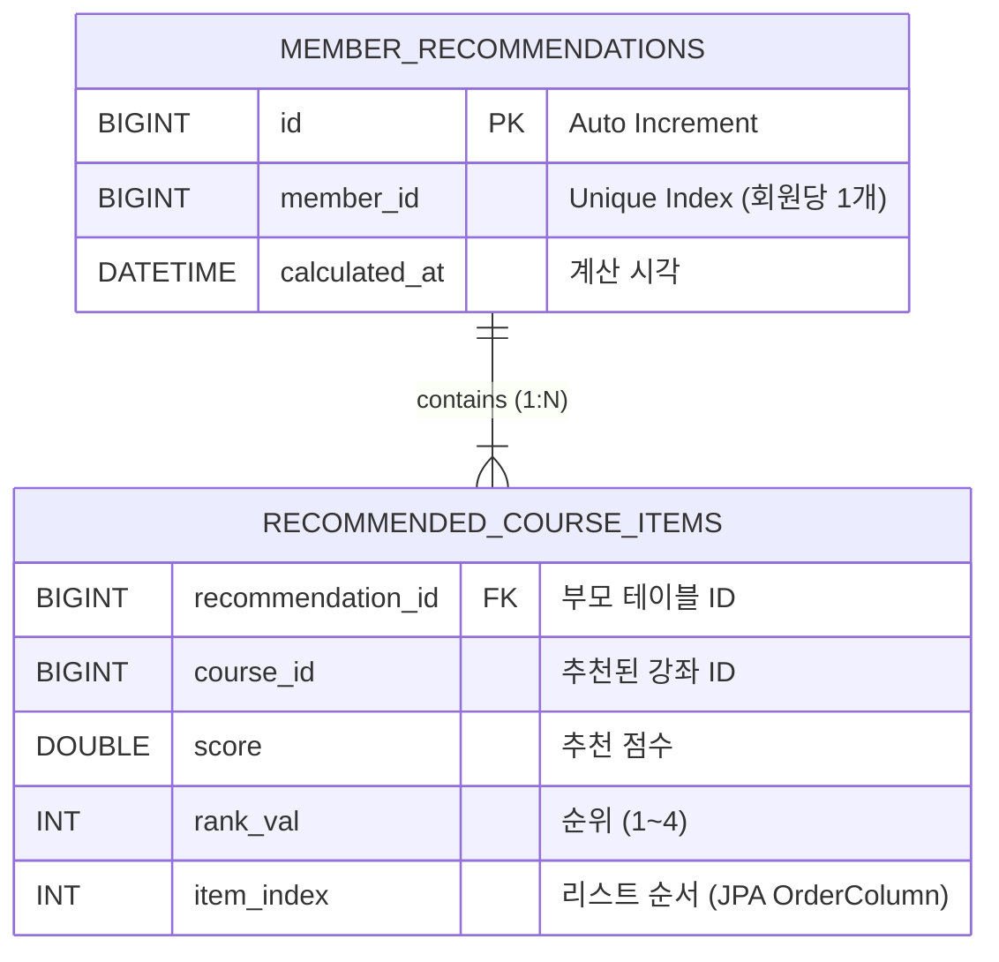

## 📋 LXP 추천 기능(Recommendation BC) 작업 브리핑

### 1. 프로젝트 개요
***

**목표:** LXP(Learning Experience Platform)의 개인화 추천 기능 구현  
**담당:** Recommendation Bounded Context  
**기술 스택:**
- Java 17, Spring Boot 3.x, MySQL 8.0, JPA, Gradle
- 아키텍처: **Modulith(멀티모듈)** + **DDD(Domain-Driven Design)** + **Layered Architecture**
- 패키지 루트: `com.lxp.recommend`

***

### 2. 핵심 비즈니스 요구사항

#### 추천 로직 우선순위
- **관심 태그(Interest Tags) >> 보유 스킬(Skills) > 난이도(Difficulty Level)**
- 이미 수강 중/완료한 강좌는 추천에서 제외

#### UI 시나리오
- **비로그인:** 최신 강좌 순 나열 (추천 기능 미사용)
- **로그인:** 홈 화면 배너에 개인화 추천 강좌 **최대 4개** 노출

#### 성능 전략
- **사전 계산 + 캐싱:** 추천은 비동기(배치)로 미리 계산하여 DB에 저장
- **1차 필터링(Candidate Generation):** DB에서 후보군 100개만 조회 → 메모리에서 정밀 계산
- **2단계 프로세스:** Fast Filtering(DB) + Ranking(Application)

***

### 3. 설계 결정사항

#### (1) ID 타입: UUID → **Long으로 변경**
- 팀 회의 결정: 성능과 관리 편의성을 위해 `BIGINT AUTO_INCREMENT` 사용
- 도메인 내부에서는 **VO(Value Object)로 감싸기:** `MemberId`, `CourseId`
- 외부 통신(API, Port)은 **원시 타입 `Long`** 사용

#### (2) 패키지 구조: DDD Layered Architecture
```
com.lxp.recommend
├─ domain
│   ├─ model (Entity, Aggregate Root)
│   │   ├─ MemberRecommendation (Aggregate Root)
│   │   ├─ RecommendedCourse (Value Object)
│   │   └─ ids (VO 패키지)
│   │       ├─ MemberId
│   │       └─ CourseId
│   ├─ service (Domain Service)
│   │   └─ RecommendationScoringService
│   ├─ repository (Interface)
│   │   └─ MemberRecommendationRepository
│   ├─ port (Interface)
│   │   ├─ MemberProfileReader
│   │   ├─ CourseMetaReader
│   │   └─ LearningStatusReader
│   └─ dto (데이터 전송용 DTO)
│       ├─ LearnerProfileView
│       ├─ CourseMetaView
│       ├─ LearningStatusView
│       ├─ DifficultyLevel (Enum)
│       └─ EnrollmentStatus (Enum)
├─ application
│   ├─ RecommendationApplicationService
│   └─ dto
│       └─ RecommendedCourseDto
├─ presentation
│   └─ RecommendationController
└─ infrastructure
    └─ persistence
        └─ JpaMemberRecommendationRepository
```

#### (3) `domain.dto` 패키지 도입
- 초기에는 `domain.support`로 설계했으나, 직관성을 위해 **`domain.dto`로 변경**
- 역할: Port가 반환하는 외부 컨텍스트 데이터 뷰(View) 정의

***

### 4. 구현 완료 항목

#### ✅ Domain 계층
1.  **Entity 및 VO:**
    - `MemberRecommendation` (Aggregate Root, PK: Long, `@ElementCollection` 사용)
    - `RecommendedCourse` (`@Embeddable`, courseId/score/rank 포함)
    - `MemberId`, `CourseId` (VO, `@Embeddable` + `@AttributeOverride`)

2.  **Repository Interface:**
    - `MemberRecommendationRepository` (도메인 계층 인터페이스)
    - `JpaMemberRecommendationRepository` (Spring Data JPA 구현체)

3.  **Domain Service:**
    - `RecommendationScoringService`: 점수 계산 로직 (태그/스킬/난이도 가중치 적용, Top 4 추출)

4.  **Port Interfaces:**
    - `MemberProfileReader`, `CourseMetaReader`, `LearningStatusReader` (외부 컨텍스트 데이터 조회용)

5.  **DTO 정의:**
    - `LearnerProfileView`, `CourseMetaView`, `LearningStatusView`
    - `DifficultyLevel`, `EnrollmentStatus` (Enum)

#### ✅ Application 계층
- `RecommendationApplicationService`:
    - `refreshRecommendationAsync(Long memberId)`: 비동기 추천 계산 (배치/이벤트 트리거용)
    - `getTopRecommendations(Long memberId)`: UI 조회용 (빠른 DB 읽기)

#### ✅ Presentation 계층
- `RecommendationController`:
    - `GET /api/v1/recommendations/me`: 로그인 사용자 추천 조회 API
    - 인증 방식: 임시로 HTTP Header (`X-MEMBER-ID`) 사용 (Security 미정)

#### ✅ 테스트 코드
- `JpaMemberRecommendationRepositoryTest`: JPA 매핑 및 Repository 동작 검증 (`@DataJpaTest`)
- `MemberRecommendationTest`: 도메인 로직 단위 테스트 (순수 Java)

***

### 5. API 명세 (프론트엔드 전달용)

**Endpoint:** `GET /api/v1/recommendations/me`  
**인증:** `X-MEMBER-ID` 헤더 (또는 Bearer Token, 추후 확정)  
**응답 예시:**
```json
[
  { "courseId": 12345, "score": 95.5, "rank": 1 },
  { "courseId": 67890, "score": 88.0, "rank": 2 },
  { "courseId": 11111, "score": 82.1, "rank": 3 },
  { "courseId": 22222, "score": 75.0, "rank": 4 }
]
```

***

### 6. 미완료 및 다음 단계

#### 🔜 구현 필요 항목
1.  **Port 구현체 (`infrastructure.external`):**
    - `MemberProfileReaderImpl`: Member 모듈에서 프로필 조회
    - `CourseMetaReaderImpl`: Course 모듈에서 강좌 메타 조회
    - `LearningStatusReaderImpl`: Learning 모듈에서 수강 이력 조회

2.  **비동기 처리 설정:**
    - 메인 애플리케이션에 `@EnableAsync` 추가
    - 필요 시 `ThreadPoolTaskExecutor` 설정

3.  **이벤트 리스너 구현:**
    - 강좌 완료 이벤트 → `refreshRecommendationAsync` 트리거
    - 프로필 수정 이벤트 → 추천 재계산

4.  **DDL 스크립트 작성 (DB-First 정책):**
    - `member_recommendations`, `recommended_course_items` 테이블 생성 스크립트

5.  **통합 테스트:**
    - Controller → Service → Repository 전체 흐름 검증

***

### 7. 주요 설계 원칙 준수 사항

- ✅ **DIP(의존성 역전):** 도메인이 인프라에 의존하지 않음 (Port 사용)
- ✅ **계층 분리:** Presentation → Application → Domain → Infrastructure 의존 방향 엄수
- ✅ **VO 사용:** 원시 타입 집착 방지, 도메인 개념 명확화
- ✅ **CQRS 스타일:** Command(쓰기) / Query(읽기) 메서드 분리
- ✅ **성능 최적화:** Candidate Generation + Caching 전략 적용

***

이상이 현재까지 완료된 추천 기능 설계 및 구현 내용입니다. 
다음 작업으로 Port 구현 및 이벤트 처리가 예상됩니다. 

##  ERD 요구사항 

***

### 1. ERD 설계 원칙 (팀 결정 반영)

1.  **PK 타입:** `BIGINT (AUTO_INCREMENT)` 사용 (UUID 아님).
2.  **Member/Course 연동:** `member_id`, `course_id`는 FK 제약조건을 걸 수도 있지만, MSA/Modulith의 느슨한 결합을 위해 **논리적 연관(값만 저장)**만 하고 강제적 FK(Foreign Key Constraint)는 생략하는 경우가 많습니다. (여기서는 물리적 FK는 생략하고 인덱스만 거는 방식을 권장합니다.)
3.  **데이터 구조:**
    *   `member_recommendations`: 추천 결과의 메타 정보 (누구의 추천인지, 언제 계산했는지).
    *   `recommended_course_items`: 실제 추천된 강좌 리스트 (값 컬렉션).

***

### 2. ERD 다이어그램 (Mermaid)



***

### 3. MySQL DDL 스크립트

프로젝트 정책인 **'Database-First'** 접근에 맞춰, 실제 실행 가능한 DDL 스크립트를 작성했습니다.

```sql
-- 1. 추천 결과 메타 테이블 (Aggregate Root)
CREATE TABLE `member_recommendations` (
    `id`            BIGINT          NOT NULL AUTO_INCREMENT COMMENT '추천 ID',
    `member_id`     BIGINT          NOT NULL                COMMENT '회원 ID (Member 모듈)',
    `calculated_at` DATETIME(6)     NOT NULL                COMMENT '추천 계산 시각',
    
    PRIMARY KEY (`id`),
    UNIQUE KEY `uk_member_recommendation_member_id` (`member_id`)
) ENGINE=InnoDB DEFAULT CHARSET=utf8mb4 COMMENT='회원별 추천 결과 메타 정보';


-- 2. 추천 강좌 아이템 테이블 (Value Collection)
CREATE TABLE `recommended_course_items` (
    `recommendation_id` BIGINT      NOT NULL                COMMENT '추천 ID (FK)',
    `course_id`         BIGINT      NOT NULL                COMMENT '강좌 ID (Course 모듈)',
    `score`             DOUBLE      NOT NULL                COMMENT '추천 점수',
    `rank_val`          INT         NOT NULL                COMMENT '추천 순위 (1~4)',
    `item_index`        INT         NOT NULL                COMMENT '리스트 정렬 순서 (0부터 시작)',
    
    -- 외래 키 제약조건 (부모 삭제 시 자식도 삭제)
    CONSTRAINT `fk_recommended_items_recommendation_id`
        FOREIGN KEY (`recommendation_id`) 
        REFERENCES `member_recommendations` (`id`)
        ON DELETE CASCADE
) ENGINE=InnoDB DEFAULT CHARSET=utf8mb4 COMMENT='개별 추천 강좌 목록';

-- 3. 성능 최적화를 위한 인덱스 (선택 사항)
-- 강좌별 추천 횟수 통계 등을 낼 때 필요할 수 있음
CREATE INDEX `idx_recommended_items_course_id` ON `recommended_course_items` (`course_id`);
```

***

### 4. 설계 포인트 설명

#### (1) `member_recommendations`
*   **`member_id` (UNIQUE):** 한 회원당 하나의 추천 결과만 유지합니다. 새로운 추천 결과가 생기면 기존 row의 `calculated_at`을 갱신하거나, `items`를 갈아끼우는 방식입니다. (JPA의 `updateItems` 메서드 동작 방식)

#### (2) `recommended_course_items`
*   **`item_index`:** JPA의 `@OrderColumn`을 사용했기 때문에, 리스트의 순서를 보장하기 위한 컬럼이 필수입니다.
*   **`ON DELETE CASCADE`:** 부모인 `member_recommendations`가 삭제되면(회원 탈퇴 등으로), 딸린 추천 아이템들도 자동으로 삭제되도록 설정했습니다.
*   **`course_id`:** 물리적 FK를 걸지 않았습니다. Course 모듈이 독립적으로 배포되거나 DB가 분리될 가능성을 고려하여, **논리적인 참조(ID 값만 저장)**만 유지합니다.
